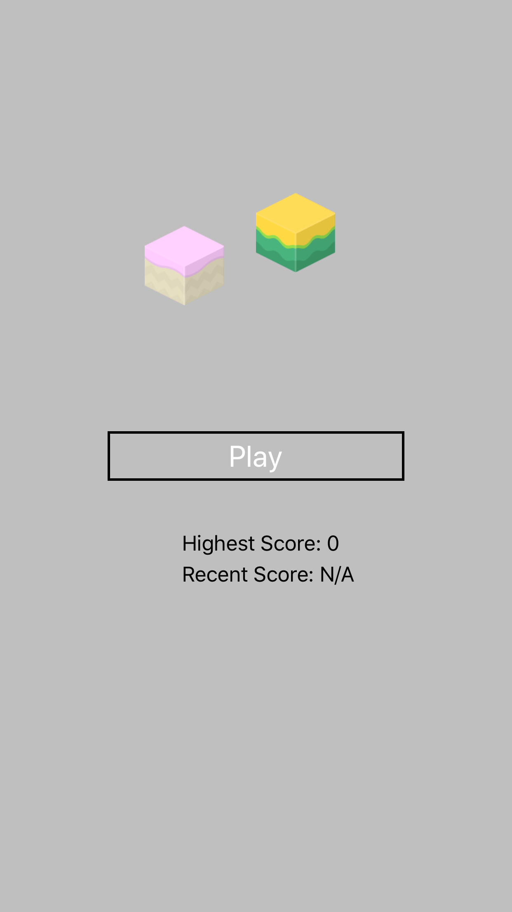
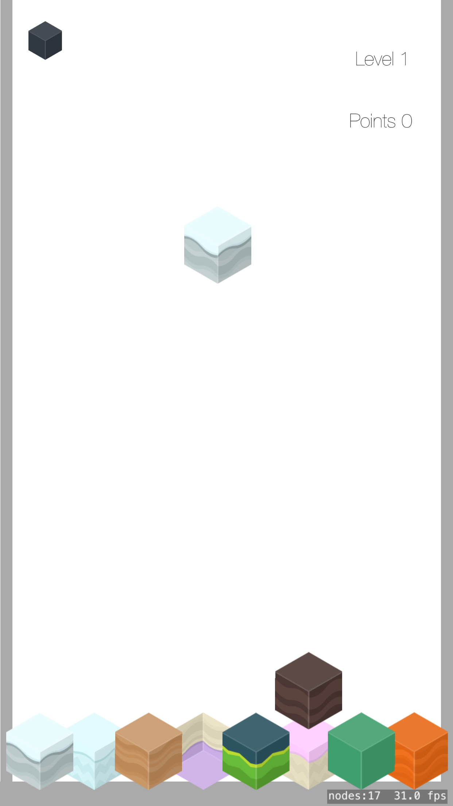

Yummy blocks is a physics based block game where colorful blocks fall and collide with each other. Blocks that are of the same color will be damaged when they touch each other and eventually be destroyed (depending on level). Every time 20 blocks are destroyed the level and difficulty will increase. The game is over when there are over 70 blocks on the screen.  
“Sound effects obtained from https://www.zapsplat.com and http://soundbible.com/tags-pop.html (Attribution 3.0 or Public Domain“  
Isometric blocks is licensed as:  
License: (CC0 1.0 Universal) You're free to use these game assets in any project, personal or commercial. There's no need to ask   permission before using these. Giving attribution is not required, but is greatly appreciated!  

  

Poupi Great Adventures : The Arcade Game by Komiku is licensed under a CC0 1.0 Universal License. renamed to arcade_game.png to make the   file  name shorter.  
